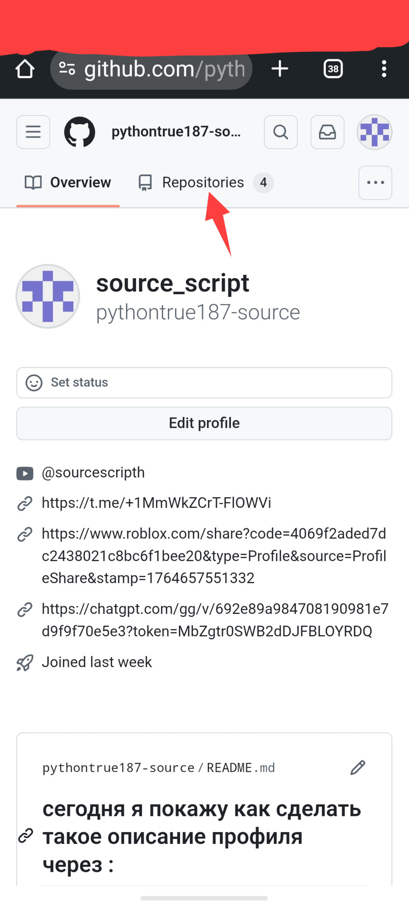
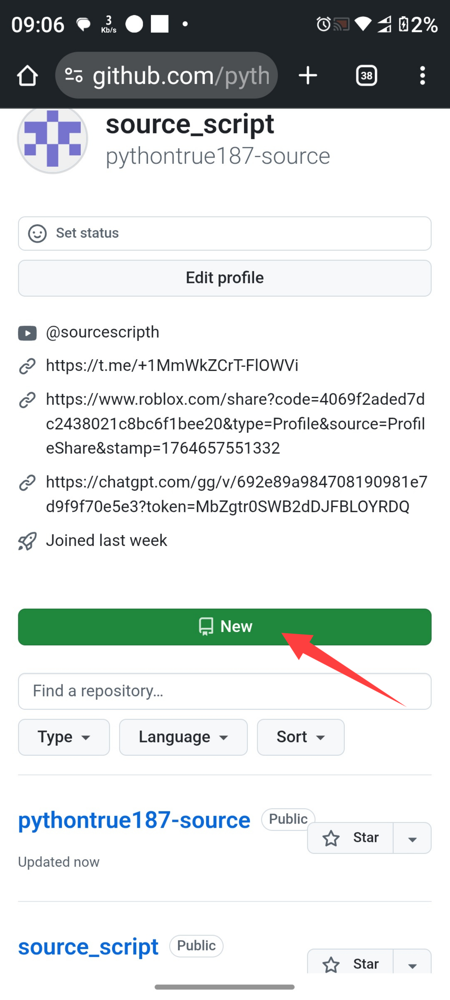
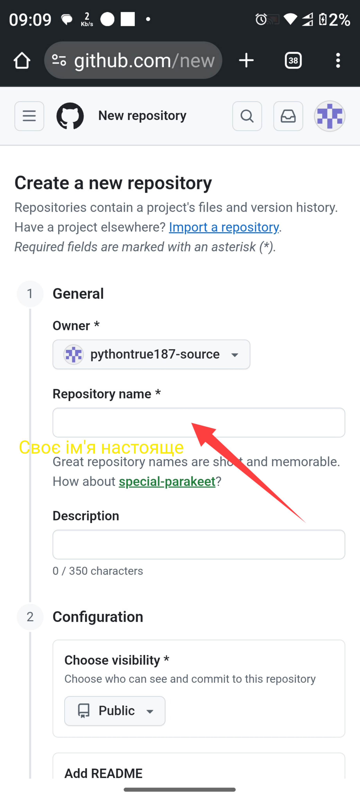

## сегодня я покажу как сделать вот это в профиле 

## шах 1 

## шах 2 

## шах 3 

будет 

General
Repository owner and name
Owner(required)
*
Repository name
*
pythontrue187-source
pythontrue187-source is available.
Special profile readme repository
pythontrue187-source/pythontrue187-source is a ✨special ✨ repository that you can use to add a README.md to your GitHub profile. Make sure it’s public and initialize it with a README to get started
только будет ваше имя 
потом редактируйте и все

